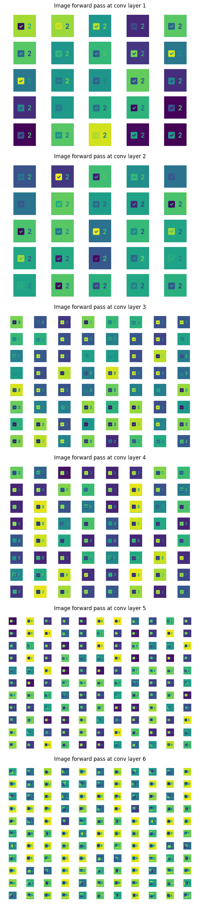

# Checkbox CNN
This repository contains the training and inference files for a series of convolutional neural networks designed to classify images of html checkboxes.

The contents of this readme are organized as follows:
1. [The Assignment](#1)
2. [Setup](#2)
    1. [Initial Setup](#2.1)
    2. [Setup Option I](#2.2)
    3. [Setup Option II](#2.3)
    4. [Setup Option III](#2.4)
3. [Testing](#3)
    1. [Data](#3.1)
    2. [Evaluation](#3.2)
    3. [Training](#3.3)
    4. [Visualizing](#3.4)
4. [First Attempt](#4)
    1. [Approach](#4.1)
    2. [Data](#4.2)
    3. [Model](#4.3)
    4. [Results](#4.4)
    5. [Visualization](#4.5)
    6. [Improvement](#4.6)
4. [Second Attempt](#5)
    1. [Approach](#5.1)
    2. [Data](#5.2)
    3. [Model](#5.3)
    4. [Results](#5.4)
    5. [Visualization](#5.5)
    6. [Improvement](#5.6)

## The Assignment <a name="1"></a>
Given a dataset of ~500 png image files categorized as "checked", "unchecked" or "other", train a classifier that can classify a novel image into one of these three categories. This assignment was provided as part of an interview process, and as such, I no longer have access to the dataset used in training the model. If you'd like to recreate the training portion of the model, you must procure access to the dataset or to another similar dataset on your own.

## Setup <a name="2"></a>
There are three ways to get setup with this project, which will be described in order of increasing difficulty. All three methods require some initial setup depending on what the user intends to test.

### Initial Setup <a name="2.1"></a>
To begin with the project, clone this repository and download the weights from [this google drive link.](https://drive.google.com/drive/folders/12WSQ4Nt_Atw3eArEQzovBqViyTrb5CDH?usp=sharing) Both of these binary files should be placed inside of the 'weights' directory at the root of the repository, and will be used as the trained model weights for the respective model versions. This is the only component of the manual setup that is absolutely necessary.

If the user also wants to be able to train the model from scratch, they must download the compressed dataset file. The expanded contents of this compressed file (a directory called 'data', with subdirectories 'checked', 'unchecked' and 'other', each containing a sequence of PNG images) should be placed in the root directory of the cloned repository. These files comprise the data that will be used for training and validation of the model, on which the CheckboxData class relies. Even if not training the model, this directory and its contents are necessary so that transform functions used in other parts of the project may be derived.

Lastly, if the user wants to 'infer', or test the model's predictive ability on a new image, these images should be copied into 'tests' directory contained within the root directory. Some examples of test cases have already been provided (2 checked, 2 unchecked).

If all of these directions are followed, the resulting final directory should look like:
```
checkbox-cnn/
├─ data/
│  ├─ checked/
│  │  ├─ 0a4cbf5a03dd31a4782e752cf1fbd5d6.png
│  │  ├─ ...
│  ├─ other/
│  ├─ unchecked/
├─ readme/
│  ├─ v1report.png
│  ├─ v2report.png
├─ src/
│  ├─ __init__.py
│  ├─ data.py
│  ├─ evaluate.py
│  ├─ model.py
│  ├─ train.py
├─ tests/
│  ├─ checkedtest.png
│  ├─ uncheckedtest.png
│  ├─ add your test images here...
├─ weights/
│  ├─ 00.bin
│  ├─ 81v1.bin
│  ├─ 83v2.bin
├─ .gitignore
├─ Dockerfile
├─ LICENSE
├─ README.md
├─ requirements.txt
├─ run.sh
├─ setup.sh
```

### Option 1: Bash scripts <a name="2.2"></a>
If bash is available in the testing environment, simply run `bash setup.sh` with the current working directory as the root directory of the cloned repository. This will automatically build a Docker image of the project and spin up a docker container of the image, as well as open an interactive bash terminal so that commands can be executed. If you quit the terminal, you can reopen it without recreating the Docker image by running `bash run.sh` instead.

### Option 2: Manually create docker container <a name="2.3"></a>
If you'd like to create a Docker environment manually, you can do so with the provided Docker file. Simply run the following command at the root directory:
```
docker build -t <image_name> .
```

Then, to use the image to create and run a new container, do the following:
```
docker run -it --rmi <image_name> bash
```

Note that the commands exposed by the project are the scripts themselves, and as such, must be run directly (run as \__main__) rather than within an interactive python terminal. Attempting to import modules within an active python terminal will result in import errors because the imports are not relative (allowing the scripts to be run directly). Consequently, we opt for opening a bash interactive terminal instead in the `docker run` command.

### Option 3: Create a new virtual environment <a name="2.4"></a>
If neither of the above options are available, you can create a new python virtual environment (or do so in conda), and pip install the provided requirements using `pip install -r requirements.txt`. If you use conda, ensure that pip is installed into the fresh virtual environment using `conda install pip` before running the above command.

This project has the following dependencies:
 - tqdm
 - numpy
 - matplotlib
 - torch
 - torchvision
 - opencv-python
 
If for any reason any of these packages fail to install, the project will not work as expected or not work at all. Please ensure that they are all properly installed prior to running any of the scripts.

## Testing the Project <a name="3"></a>
If you setup the project using option 3, change your current working directory to be the root directory of the project. If you setup the project using options 1 or 2, you should be at the root directory of the project by default when spinning up the docker container. All of the commands exposed by the project should be run at this top-level directory.

Four python scripts are available to be used in the /src directory:
 - data.py
 - model.py
 - train.py
 - evaluate.py

### src/data.py <a name="3.1"></a>
This script contains a class called CheckboxData, which is a dataloader initializer that is used in the training and evaluation of the CNN models. When the script is run directly with an integer argument, it will print some stats about the dataset, where the passed argument is used to determine the number of each class present in the training dataset.

Example Usage:
```
python src/data.py 300
```

Example Output:
```
TRAINING STATS
--------------
BATCHES: 57 batches per epoch
BATCH SIZE: 16 samples per batch
IMAGES: 3 channel images of size [512, 512]
SAMPLES: 900 total samples
CLASS BREAKDOWN: Counter({0: 300, 1: 300, 2: 300})

TEST STATS
----------
BATCHES: 7 batches per epoch
BATCH SIZE: 16 samples per batch
IMAGES: 3 channel images of size [512, 512]
SAMPLES: 103 total samples
CLASS BREAKDOWN: Counter({0: 46, 2: 30, 1: 27})
```

By default, CheckboxData will split the total available raw data according to some fraction (by default 0.2, or 20%), which will determine the number of samples in the training and validation splits. After being split, the training data is balanced such that each class contains n samples, where additional samples are generated by passing an image from the class through a randomly determined transform. Using this method, we can generate arbitrarily large training datasets, although the extent to which more samples of the same transformed data aids in our classification problem is limited.

> **_NOTE:_**  This process of evening the class distribution and generating samples through random transforms was **not used in the first CNN (CheckboxCNNv1)**. Read the full report to see the motivation for this implementation.

### src/evaluate.py <a name="3.2"></a>

This script contains functions for evaluating model performance on a dataset, as well as inferring the class of a single image sample. When the script is run directly provided with a path to an image as an argument, it will perform inference on the image present at the path.

Example Usage:
```
python src/evaluate.py tests/my_test_image.png
```

Example Output:
```
Predicted class of image at tests/my_test_image.png: checked
```

Alternatively, the user may elect to provide the "all", which will infer the class of every single image in the tests directory in turn.

Example Usage:
```
python src/evaluate.py all
```

Example Output:
```
Predicted class of uncheckedtest2.png: other
Predicted class of checktest1.png: checked
Predicted class of checktest2.png: unchecked
Predicted class of uncheckedtest1.png: unchecked
Predicted class of my_test_image.png: checked
```
> **_NOTE:_**  This script uses the second model (CheckboxCNNv2) for inference because of its superior performance on the validation set.

### src/train.py <a name="3.3"></a>

This script contains the primary training loop for the models, and performs training on a specified model when run directly. Passed argument should be one of "v1" or "v2" to specify which of the models is being trained.

Example Usage:
```
python src/train.py v2
```

Example Output:
```
Put the output here
```

Running the script will continuously reinitialize the model, training for 30 epochs and saving after a completed epoch if the performance on the validation set is higher than the previous best (saving a checkpoint). After 30 epochs have been trained, the model begins again from randomly initialized weights.

> **_NOTE:_**  This script runs indefinitely, and therefore must be manually terminated using a keyboard interrupt (CTRL-Z).

### src/model.py <a name="3.4"></a>

This script contains the CheckboxCNN base class, which provides functionality for weight initialization and visualization, as well as CheckboxCNNv1 and CheckboxCNNv2 which are the actual models containing the neural networks. 

When run directly, this script produces a comprehensive visualization of the weights inside the filters of the convolutional layers by sending an image through the forward pass, and taking out the intermediate output at each layer. These filters are then 1 by 1 cast to images in a grid, which is performed for each layer. Collectively, this allows us to visualize how each filter is activated by a sample image.

When running the script directly, the model version to be visualized can be specified.

Example Usage:
```
python src/model.py v1
```

This command outputs an image file, "v1report.png", to the root directory. To see these reports on the current highest performing weights of the model, please see [visualization of CheckboxCNNv1](#4.5) or [v2](#5.5)

> **_NOTE:_**  This script only outputs to "v1report.png" or "v2report.png" in the root directory. Functionality for changing the output path is currently not implemented.

## CheckboxCNN v1 <a name="4"></a>


### Approach <a name="4.1"></a>

### Data Preparation <a name="4.2"></a>

### Model Design <a name="4.3"></a>

### Results <a name="4.4"></a>

### Visualization <a name="4.5"></a>


### Improvements <a name="4.6"></a>

## CheckboxCNN v2 <a name="5"></a>

### Approach <a name="5.1"></a>

### Data Preparation <a name="5.2"></a>

### Model Design <a name="5.3"></a>

### Results <a name="5.4"></a>

### Visualization <a name="5.5"></a>



### Improvements <a name="5.6"></a>