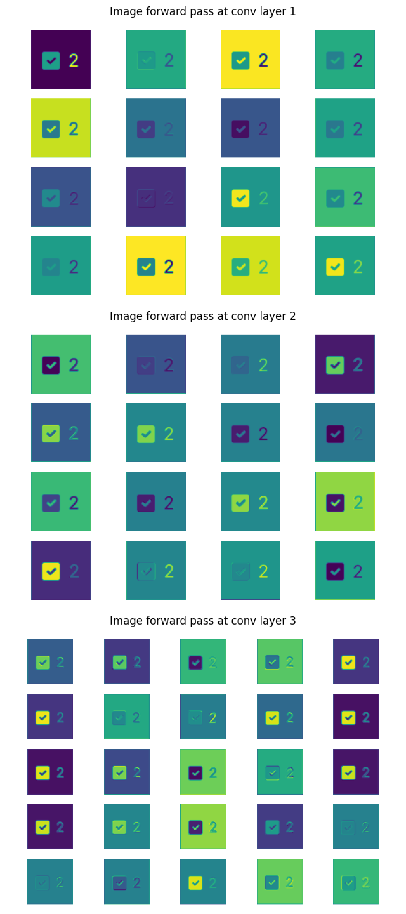

# Checkbox CNN
This repository contains the training and inference files for a series of convolutional neural networks designed to classify images of html checkboxes.

The contents of this readme are organized as follows:
1. [The Assignment](#1)
2. [Setup](#2)
    1. [Initial Setup](#2.1)
    2. [Setup Option I](#2.2)
    3. [Setup Option II](#2.3)
    4. [Setup Option III](#2.4)
3. [Testing](#3)
    1. [Data](#3.1)
    2. [Evaluation](#3.2)
    3. [Training](#3.3)
    4. [Visualizing](#3.4)
4. [First Attempt](#4)
    1. [Approach](#4.1)
    2. [Data](#4.2)
    3. [Model](#4.3)
    4. [Results](#4.4)
    5. [Visualization](#4.5)
    6. [Improvement](#4.6)
4. [Second Attempt](#5)
    1. [Approach](#5.1)
    2. [Data](#5.2)
    3. [Model](#5.3)
    4. [Results](#5.4)
    5. [Visualization](#5.5)
    6. [Improvement](#5.6)

## The Assignment <a name="1"></a>
Given a dataset of ~500 png image files categorized as "checked", "unchecked" or "other", train a classifier that can classify a novel image into one of these three categories. This assignment was provided as part of an interview process, and as such, I no longer have access to the dataset used in training the model. If you'd like to recreate the training portion of the model, you must procure access to the dataset or to another similar dataset on your own.

## Setup <a name="2"></a>
There are three ways to get setup with this project, which will be described in order of increasing difficulty. All three methods require some initial setup depending on what the user intends to test.

### Initial Setup <a name="2.1"></a>
To begin with the project, clone this repository and download the weights from [this google drive link.](https://drive.google.com/drive/folders/12WSQ4Nt_Atw3eArEQzovBqViyTrb5CDH?usp=sharing) Both of these binary files should be placed inside of the 'weights' directory at the root of the repository, and will be used as the trained model weights for the respective model versions. This is the only component of the manual setup that is absolutely necessary.

If the user also wants to be able to train the model from scratch, they must download the compressed dataset file. The expanded contents of this compressed file (a directory called 'data', with subdirectories 'checked', 'unchecked' and 'other', each containing a sequence of PNG images) should be placed in the root directory of the cloned repository. These files comprise the data that will be used for training and validation of the model, on which the CheckboxData class relies. Even if not training the model, this directory and its contents are necessary so that transform functions used in other parts of the project may be derived.

Lastly, if the user wants to 'infer', or test the model's predictive ability on a new image, these images should be copied into 'tests' directory contained within the root directory. Some examples of test cases have already been provided (2 checked, 2 unchecked).

If all of these directions are followed, the resulting final directory should look like:
```
checkbox-cnn/
├─ data/
│  ├─ checked/
│  │  ├─ 0a4cbf5a03dd31a4782e752cf1fbd5d6.png
│  │  ├─ ...
│  ├─ other/
│  ├─ unchecked/
├─ readme/
│  ├─ v1report.png
│  ├─ v2report.png
├─ src/
│  ├─ __init__.py
│  ├─ data.py
│  ├─ evaluate.py
│  ├─ model.py
│  ├─ train.py
├─ tests/
│  ├─ checkedtest.png
│  ├─ uncheckedtest.png
│  ├─ add your test images here...
├─ weights/
│  ├─ 00.bin
│  ├─ 81v1.bin
│  ├─ 83v2.bin
├─ .gitignore
├─ Dockerfile
├─ LICENSE
├─ README.md
├─ requirements.txt
├─ run.sh
├─ setup.sh
```

### Option 1: Bash scripts <a name="2.2"></a>
If bash is available in the testing environment, simply run `bash setup.sh` with the current working directory as the root directory of the cloned repository. This will automatically build a Docker image of the project and spin up a docker container of the image, as well as open an interactive bash terminal so that commands can be executed. If you quit the terminal, you can reopen it without recreating the Docker image by running `bash run.sh` instead.

Docker containers do not have access to GPUs, so they are incapable of training. If you want to train the model yourself, please use option 3.

### Option 2: Manually create docker container <a name="2.3"></a>
If you'd like to create a Docker environment manually, you can do so with the provided Docker file. Simply run the following command at the root directory:
```
docker build -t <image_name> .
```

Then, to use the image to create and run a new container, do the following:
```
docker run -it --rmi <image_name> bash
```

Note that the commands exposed by the project are the scripts themselves, and as such, must be run directly (run as \__main__) rather than within an interactive python terminal. Attempting to import modules within an active python terminal will result in import errors because the imports are not relative (allowing the scripts to be run directly). Consequently, we opt for opening a bash interactive terminal instead in the `docker run` command.

### Option 3: Create a new virtual environment <a name="2.4"></a>
If neither of the above options are available, or you want to train the model yourself, you can create a new python virtual environment (or do so in conda), and pip install the provided requirements using `pip install -r requirements.txt`. If you use conda, ensure that pip is installed into the fresh virtual environment using `conda install pip` before running the above command.

This project has the following dependencies:
 - tqdm
 - numpy
 - matplotlib
 - torch
 - torchvision
 - opencv-python
 
If for any reason any of these packages fail to install, the project will not work as expected or not work at all. Please ensure that they are all properly installed prior to running any of the scripts. 

If you want to install a CUDA enabled version of PyTorch to train the model yourself, you must install pytorch using a different command:
```
pip3 install torch torchvision torchaudio --extra-index-url https://download.pytorch.org/whl/cu113
```
If a CUDA enabled version of PyTorch is not installed in the environment, you will be unable to train the model even if a GPU is available.

## Testing the Project <a name="3"></a>
If you setup the project using option 3, change your current working directory to be the root directory of the project. If you setup the project using options 1 or 2, you should be at the root directory of the project by default when spinning up the docker container. All of the commands exposed by the project should be run at this top-level directory.

Four python scripts are available to be used in the /src directory:
 - data.py
 - model.py
 - train.py
 - evaluate.py

### src/data.py <a name="3.1"></a>
This script contains a class called CheckboxData, which is a dataloader initializer that is used in the training and evaluation of the CNN models. When the script is run directly with an integer argument, it will print some stats about the dataset, where the passed argument is used to determine the number of each class present in the training dataset.

Example Usage:
```
python src/data.py 300
```

Example Output:
```
TRAINING STATS
--------------
BATCHES: 57 batches per epoch
BATCH SIZE: 16 samples per batch
IMAGES: 3 channel images of size [512, 512]
SAMPLES: 900 total samples
CLASS BREAKDOWN: Counter({0: 300, 1: 300, 2: 300})

TEST STATS
----------
BATCHES: 7 batches per epoch
BATCH SIZE: 16 samples per batch
IMAGES: 3 channel images of size [512, 512]
SAMPLES: 103 total samples
CLASS BREAKDOWN: Counter({0: 46, 2: 30, 1: 27})
```

By default, CheckboxData will split the total available raw data according to some fraction (by default 0.2, or 20%), which will determine the number of samples in the training and validation splits. After being split, the training data is balanced such that each class contains n samples, where additional samples are generated by passing an image from the class through a randomly determined transform. Using this method, we can generate arbitrarily large training datasets, although the extent to which more samples of the same transformed data aids in our classification problem is limited.

> **_NOTE:_**  This process of evening the class distribution and generating samples through random transforms was **not used in the first CNN (CheckboxCNNv1)**. Read the full report to see the motivation for this implementation.

### src/evaluate.py <a name="3.2"></a>

This script contains functions for evaluating model performance on a dataset, as well as inferring the class of a single image sample. When the script is run directly provided with a path to an image as an argument, it will perform inference on the image present at the path.

Example Usage:
```
python src/evaluate.py tests/my_test_image.png
```

Example Output:
```
Predicted class of image at tests/my_test_image.png: checked
```

Alternatively, the user may elect to provide the "all", which will infer the class of every single image in the tests directory in turn.

Example Usage:
```
python src/evaluate.py all
```

Example Output:
```
Predicted class of uncheckedtest2.png: other
Predicted class of checktest1.png: checked
Predicted class of checktest2.png: unchecked
Predicted class of uncheckedtest1.png: unchecked
Predicted class of my_test_image.png: checked
```
> **_NOTE:_**  This script uses the second model (CheckboxCNNv2) for inference because of its superior performance on the validation set.

### src/train.py <a name="3.3"></a>

This script contains the primary training loop for the models, and performs training on a specified model when run directly. Passed argument should be one of "v1" or "v2" to specify which of the models is being trained.

Example Usage:
```
python src/train.py v2
```
Performance checkpoints will be saved inside of the weights directory as the model trains.

Running the script will continuously reinitialize the model, training for 30 epochs and saving after a completed epoch if the performance on the validation set is higher than the previous best (saving a checkpoint). After 30 epochs have been trained, the model begins again from randomly initialized weights.

This script will not run without access to a GPU and a CUDA enabled installation of PyTorch. If either of these conditions is not met when the script is run, a RuntimeError will be raised. If you set up the project using either of the first two methods (involving a Docker container), this script will not function.

> **_NOTE:_**  This script runs indefinitely, and therefore must be manually terminated using a keyboard interrupt (CTRL-Z).

### src/model.py <a name="3.4"></a>

This script contains the CheckboxCNN base class, which provides functionality for weight initialization and visualization, as well as CheckboxCNNv1 and CheckboxCNNv2 which are the actual models containing the neural networks. 

When run directly, this script produces a comprehensive visualization of the weights inside the filters of the convolutional layers by sending an image through the forward pass, and taking out the intermediate output at each layer. These filters are then 1 by 1 cast to images in a grid, which is performed for each layer. Collectively, this allows us to visualize how each filter is activated by a sample image.

When running the script directly, the model version to be visualized can be specified.

Example Usage:
```
python src/model.py v1
```

This command outputs an image file, "v1report.png", to the root directory. To see these reports on the current highest performing weights of the model, please see [visualization of CheckboxCNNv1](#4.5) or [v2](#5.5)

> **_NOTE:_**  This script only outputs to "v1report.png" or "v2report.png" in the root directory. Functionality for changing the output path is currently not implemented.

## CheckboxCNN v1 <a name="4"></a>

### Approach <a name="4.1"></a>

An precursory exploration of the data will reveal several key factors that severely limit the upper bound of our model's efficacy:
1. Imbalanced distribution of samples among classes
2. Inconsistent image features
3. Small sample size

While the nature of the problem is quite well suited to a convolutional neural network, these problems with the dataset limit the scope of what a CNN can accomplish. Namely, a network that is too deep (or deep at all) will have a difficult time learning anything with so little training data. The images would also need to be normalized in some fashion so that the inputs to the CNN are constant, at least in their dimensions.

### Data Preparation <a name="4.2"></a>

In my first approach to building a model, I decided to primarily tackle issue 2 by applying a set of normalizing transforms to each image. Variance in image dimensions was quite high, with some images having lengths as long as 1600px. Becuase most of the images were able to conform quite neatly to a square image, I decided that images would be padded until they were square using the least amount of padding possible, such that only the smaller dimension receives any padding. Then, images are resized to a standard 512x512 before being normalized.

This sequence of transformations is performed identically on both the training and validation data.

### Model Design <a name="4.3"></a>

Given the limited nature of the dataset, I initially approached model design by aiming for something rather shallow. With only ~500 samples to train on, a deep network is not only susceptible to a lack of learning in deeper layers, but complete memorization of the dataset rather than real learning within the feature space. Efforts to avoid these outcomes came in the form of several micro and macro architectural decisions:
 - We should avoid too many layers, especially fully connected layers. The network should not be too deep
 - We should avoid an excessive amount of filters in convolutional layers; the classification problem likely doesn't require a ton of features because the objects we are trying to classify are relatively simple, both semantically and geometrically.
 - We should use relatively high-probability dropout wherever possible to avoid overfitting and/or memorization of our very small dataset.
 
Given the rather large initial image size of 512x512, I also decided to employ maxpooling more frequently than would be considered standard. I applied it to every convolutional layer, bringing the total module count per 'layer' to 4. Each convolutional layer consists of the following transformations:
1. A convolutional layer whose number of filters is at least equal in magnitude to the number of input channels.
    1. Filter size is always 3x3
    2. Strides are always 1
    3. Padding is always 1
2. A 2D Batchnorm layer to help with model convergence
3. A ReLU activation
4. A 2D MaxPooling layer with a stride of 2, effectively halving the dimensions of the output

This design is good for a few reasons. Firstly, The hyperparameters of the convolutional layer are tuned such that the dimensions of the output tensor (in height and width) are exactly the same as those of the input. Secondly it naturally allows for an increase in the number of filters as information in the image becomes more condensed from the pooling operations. As the information represented in each convolved feature becomes more and more dense, more filters are needed to accurately asses what information is represented in the input.

The model contains 2 layer sequences; a convolutional sequence and a classifier. The first is a sequence of 3 convolutional layers (the 4 module structure laid out above), with corresponding filter counts of 16, 24, and 32 respectively. The classifier is a series of two fully connected layers with some heavy dropout inbetween each, with a final 3 neuron output on the end corresponding to the classes.

Because this is a relatively simple classification problem, cross entropy loss seemed most appropriate for the loss function. Nothing fancy about this decision.

For the optimizer, I chose Adam simply because it seems to be a good default option. The ability to update parameters at different rates on a per-parameter basis often leads to better performance and faster convergence speeds than more traditional optimizers like vanilla SGD.


### Results <a name="4.4"></a>

This first attempt at the model performed quite well, all things considered. It quite consistently breaks 70% accuracy on the validation set, and peaked at 81% accuracy on the validation set over a course of around an hour of training and resetting. Because its so shallow, it trains relatively quickly and begins to encounter problems of overfitting as early as 10 epochs. However, with the limited available data this was unsurprising.

### Visualization <a name="4.5"></a>

A visualization of the convolutional layers' activations on a sample image reveal that it distinguishes quite clearly between 3 classes. These distinctions are most salient in the final layer, where the proportion of activation in the checkbox vs outside of the checkbox seems to vary substantially but predictably.



### Improvements <a name="4.6"></a>

Given that neural networks seem to become more powerful models the deeper they get (supposing that there is enough to train them), it seemed to me that the largest potential for improvement lie in the ability to sufficiently train a deeper CNN. 

To improve this model, then, the largest gains would come from improvements to the data, and sebsequently improvements to the CNN's structure.

There were also a few elements of the training that needed to be improved. Namely, the model seemed to oscillate around a minima rather than slowly descending towards it, indicating that Adam alone was insufficient to adjust the learning rate of the model

## CheckboxCNN v2 <a name="5"></a>

### Approach <a name="5.1"></a>

Motivated by the problems described in in the conclusions of the previous model, I first sought to improve the quality of the training data. Given that the training data used for this second CNN would be so considerably improved, I greatly expanded the depth of the network, both in the convolutional sequence and the classifier.

### Data Preparation <a name="5.2"></a>

Given the nature of the assignment, it seemed innapropriate to seek new samples to expand the dataset manually. Instead I opted to apply randomly determined transformations to the training data to generate novel samples. The proportions of each class would also be equalized, such that no class was inherently more likely to be output simply because it was more abundant in the training data. 

To accomplish this, I sampled images from the desired class until I reached the target number of samples, applying a random transform each time. Using this methodology, one can generate arbitrarily large, balanced datasets from a finite number of samples, although the benefit conferred by continuously generating new samples from the same data seems to have harshly diminishing returns.

### Model Design <a name="5.3"></a>

Now, armed with a training dataset nearly 8 times as large as that which was used to train the first model, I decided that this second implementation would have far more convolutional layers and far more filters per layer.

The second implementation has 6 convolutional layers total compared to the original 3, with a filter count progression of 32, 32, 64, 64, 128, 128. The classifier is also far more complex, with twice as many fully connected layers.

This implementation still used both cross entropy loss and Adam, but also used an LR step scheduler to alleviate some of the previous issues with Adam. The LR scheduler applied an exponential decay to the maximum possible learning rate after each epoch to ensure that learning rates progressively slowed down.

### Results <a name="5.4"></a>

This model performed considerably better than its predecessor, although its peak performance was not much better sitting at only 83.5% validation accuracy. It was however far more likely to converge than the previous implementation, and had far more consistent, stable training. It regularly reached over 80% accuracy and saw more regular, steady jumps in performance across training epochs.

While both stability and performance increased with this iteration of the model, it remains that the top level performance gains were minimal, and I can't help but feel that this was still a limitation in the data itself. While extrapolating new samples from existing data can aid in generalizing, especially in much larger datasets, there exists a point beyond which it doesn't help.

### Visualization <a name="5.5"></a>

Visualizing the filters of this model, we see some of the same patterns emerging as those from the previous model, namely the three way category split across the filters. There seems to be a very distinct, consistent split among 3 different 'types' of filter: one which has high activation in the box and low activation out, one which has the opposite, and one which has relatively mild activation in both. In these filters however, especially in the last layer, there seems to be far more variance in what portions of the box are contributing to the activation, pointing towards some kind of edge detection capabilities.


### Improvements <a name="5.6"></a>

Viewing this problem from a different paradigm entirely, it may have been a better idea to train two entirely different binary classifiers. The classes "other" and "checked" seem far more alike eachother than they are to "other". It seems instead that this problem may be appropriate for two distinct binary classifications, the first being "checkbox" or "other", and the second being "checked" or "unchecked" if the former was "checkbox". This would allow the networks to focus on the differences between the classes at a more appropriate scale, as the differences between "checkbox" and other are large and encompass the entire image, where the distinction between "checked" and "unchecked" is often the opposite.

I still believe that the largest improvements to be made will come from improvements to the dataset. 500 samples is simply too small to expect any highly effective model.